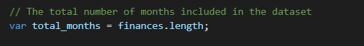
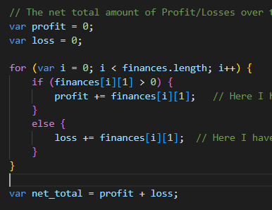
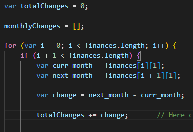
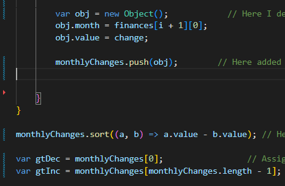

# Console-Finances

## Description

This Console.finances project demonstrates JavaScript concepts and skills that I have learned so far.
I have created calc.js file to include Javascript programming for all calculations.
This project shows Javascript programming to calculate different mathematical expressions like total months, net amount of profit/losses, average changes and greatest increase and decrease in profits/losses over entire period.

* Calculation of total number of months

I calculated total months by considering total length of finances array. Total months is nothing but entire length of finances array.

* The net total amount of Profit/Losses over the entire period

To calculate net total amount of Profit/losses I declared two variables profit, loss. 
I used if condition with more than zero to consider profits and add up all profits ranging from 0-85 of first array and second index of second array.
I used else condition with less than zero to consider losses and add up all losses ranging from 0-85 for first array and second index of second array.
Then calculated net totalamount by adding profit and loss.

* The average of the **changes** in Profit/Losses over the entire period.

To calculate changes from month to month I first declared two variables called curr_month, next_month to calculate changes between next month and current month.
Then added all changes using variable totalChanges and calculated averages by dividing totalchanges over finances.length- 1.

* The greatest increase in profits (date and amount) over the entire period
The greatest decrease in losses (date and amount) over the entire period

To calculate greatest increase and decrease in profit I declared an object with two variables month, value to consider date and change.
Then added this object to an empty monthlyChanges array, sorted this array in ascending order to get greatest decrease with monthlyChanges of 0 index and increase with monthlyChanges of monthlyChanges.length -1 index profit over the entire period.

### The URL of the deployed application

### The URL of the GitHub repository that contains my code

## Installation

N/A

## Usage

This project is used to demonstrate financial mathematical calculations using JavaScript programming.

## Credits

N/A

## License

Please refer to the LICENSE in the repo.
